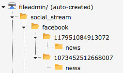

.. ==================================================
.. FOR YOUR INFORMATION
.. --------------------------------------------------
.. -*- coding: utf-8 -*- with BOM.

.. include:: ../Includes.txt

.. _configuration:

Configuration Reference
=======================

TYPOSCRIPT
----------

- Add the social_stream Template to your Main Template
- Switch to the constant editor
- Choose **SOCIAL_STREAM**
- Insert your storagePid and your email

SOCIAL_STREAM
^^^^^^^^^^

.. container:: ts-social-stream

	=========================== ============= ========================================================================
	Property                    Default       Value
	=========================== ============= ========================================================================
	Default storage PID                       The pid of the folder where the records are saved
	Notification E-Mail                       Email Adress for the admin to receive information if an error occurs
	Limit for Posts to fetch    100           How many posts should be fetched during the API call
	tmp Folder                  /tmp/         Server folder used to save images so that they can be moved afterwards
	File Storage                1             File Storage where the images are saved
	Sub Folder                  social_stream Sub folder of the file Storage where the images are saved
	=========================== ============= ========================================================================

- Choose **SOCIAL_STREAM_KEYS**
- Insert the ID and the secret of the Channels, you want to use later

SOCIAL_STREAM_KEYS
^^^^^^^^^^

.. container:: ts-social-stream-keys

	=========================== ============= ========================================================================
	Property                    Default       Value
	=========================== ============= ========================================================================
	<Channel> App ID                          The ID of the <Channel> App
	<Channel> App Secret                      The secret of the <Channel> App
	=========================== ============= ========================================================================

SCHEDULER
---------

- Menu **Scheduled tasks**
- Create a new task with the class  ``extbase`` - ``Extbase CommandController Task`` and enter the rootPage ID if your Root Page hasn't the ID 1
- Type ``Recurring``, Frequency ``0 0 * * *``

.. warning::
    If you still use the _cli_scheduler user -> make sure it has a filemount to 'fileadmin'
    Otherwise no Images can be stored in the fileadmin

