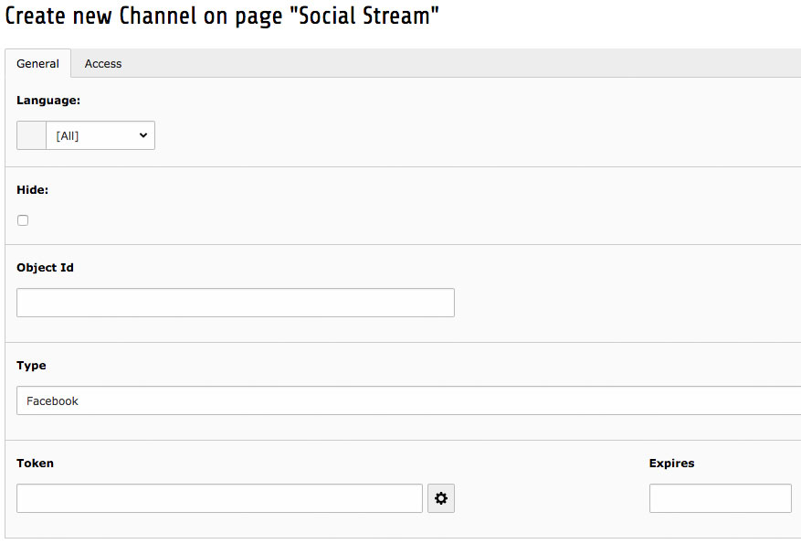
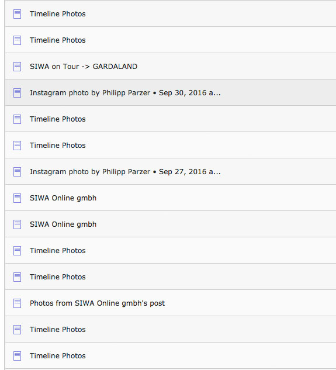

.. ==================================================
.. FOR YOUR INFORMATION
.. --------------------------------------------------
.. -*- coding: utf-8 -*- with BOM.

.. include:: ../Includes.txt

.. _user-manual:

Users Manual
============

- Use List View
- Go to the folder where you want to store all your social data
- Add new record **Social Stream -> Channels**
- Insert your social media page UID
  - e.g. for facebook you can use https://findmyfbid.com/
- Save
- Click on the Icon next to the 'token' field
- Follow the steps through the API call
- You should now have a token in the field
- Save

- If your scheduler is already configured, the posts should be created after midnight
- The news records should be now available in your storage folder
- You can now use the posts like normal tx_news records

